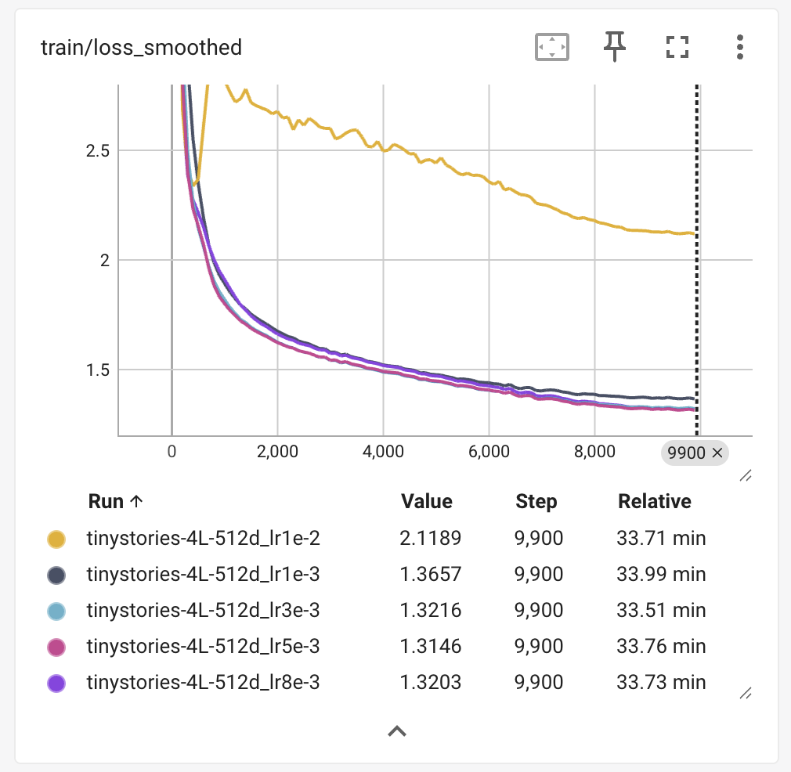
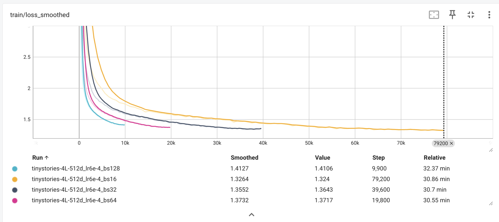
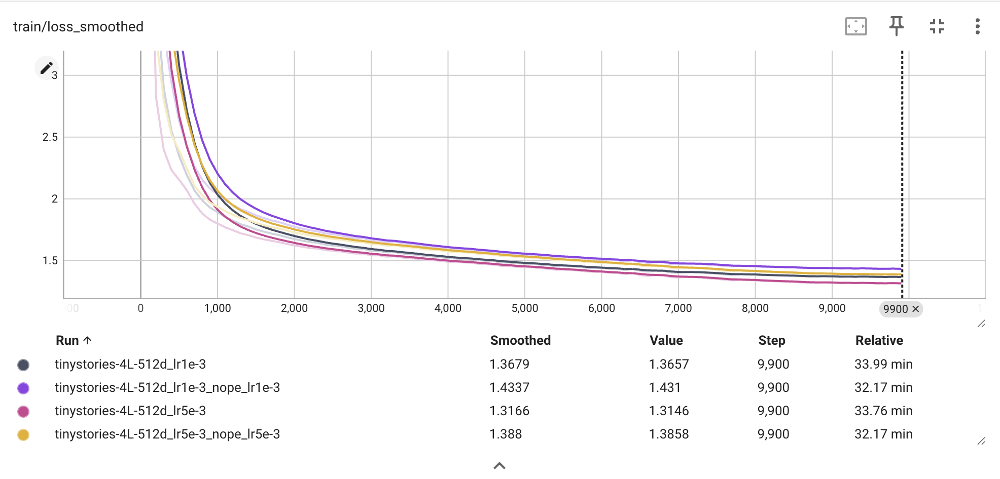
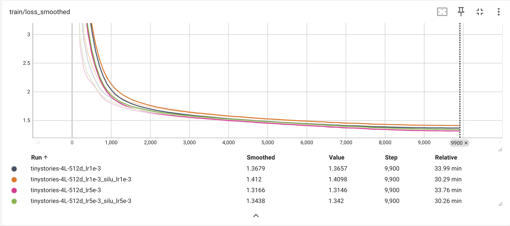
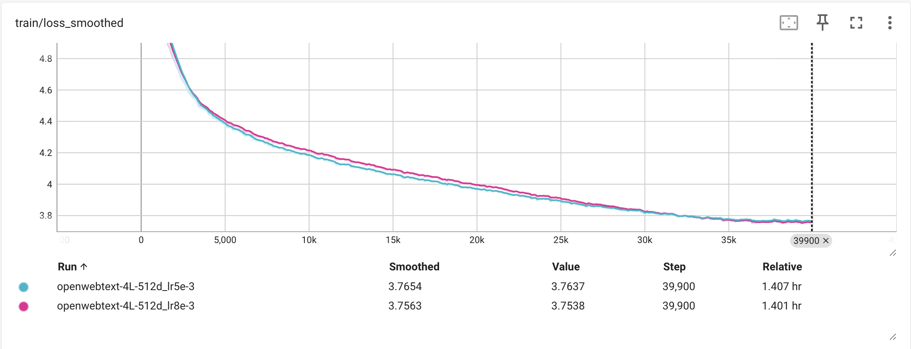

## Unicode1

(a) 空串 `""`；

(b) `__str__(chr(0))` 给出空串，`__repr__(chr(0))` 给出 `'\x00'`，即用引号包裹的 unicode；

(c) 

```py
>>> chr(0)
'\x00'
>>> print(chr(0))

>>> "this is a test" + chr(0) + "string"
'this is a test\x00string'
>>> print("this is a test" + chr(0) + "string")
this is a teststring
```


## Unicode2

(a) 平均信息密度高（编码字母只需要 $1$ 字节），用 00 填充的情况更少，符合互联网文本存储格式；

(b) `b'\xf0\x9f\xa4\x93'`，emoji 🤓 的 Unicode。UTF-8 是变长的，任何在 UTF-8 下编码超过一字节的都会在 `.decode` 开头字节的时候直接报错。

(c) `b'\xf0\x9f`，`0xf0` 说明接下来还会有 3 byte 来一起编码一个字符，但接下来只有 1 byte 了，解码时报错。


## train_bpe_tinystories

(a) 

```
Time taken: 88.10 seconds (0.0245 hours)
Peak memory usage: 2.31 GB
Vocabulary size: 10000
Number of merges: 9743
Longest token: b' accomplishment' (15 bytes)
As string: ' accomplishment'
```

(b) 在 valid-set 上，pretokenize 花费 0.74s，train 花费 3.67s；在 train-set 上，pretokenize 花费 74.03s， train 花费 13.57s。


## train_bpe_expts_owt

(a)

```
Time taken: 12932.71 seconds (3.5924 hours)
Pretokenize time: 525.41 seconds
Train time: 8944.50 seconds
Peak memory usage: 28.58 GB
Vocabulary size: 32000
Number of merges: 31743

Longest token: b'\xc3\x83\xc3\x82\xc3\x83\xc3\x82\xc3\x83\xc3\x82\xc3\x83\xc3\x82\xc3\x83\xc3\x82\xc3\x83\xc3\x82\xc3\x83\xc3\x82\xc3\x83\xc3\x82\xc3\x83\xc3\x82\xc3\x83\xc3\x82\xc3\x83\xc3\x82\xc3\x83\xc3\x82\xc3\x83\xc3\x82\xc3\x83\xc3\x82\xc3\x83\xc3\x82\xc3\x83\xc3\x82' (64 bytes)
As string: 'ÃÂÃÂÃÂÃÂÃÂÃÂÃÂÃÂÃÂÃÂÃÂÃÂÃÂÃÂÃÂÃÂ'
```

(b)

网络数据更难清洗，导致 owt 上的最长 token 不是有意义的单词；owt 数据集显著大于 TinyStories，这导致 merge 阶段慢很多。


## tokenizer_experiments

(a)

TinyStories tokenizer (10K) compression ratio (bytes/token): 4.0908
OpenWebText tokenizer (32K) compression ratio (bytes/token): 4.5357

(b)

OpenWebText sample with TinyStories tokenizer (bytes/token): 3.3438
OWT token count multiplier (TinyStories vs OWT tokenizer): 1.356x
OWT bytes/token change vs OWT tokenizer: -26.28%

TinyStories 中多简短故事，用词相对简单，且 vocab 更小，对 owt 中的少见词汇、URL 模式等不能很好地匹配，被切为更多的 tokens，压缩率显著下降。

(c)

OWT tokenizer 在 OWT 上约 ~1.5 MB/s，用这个吞吐量粗估 Pile 825GB 时间：$t \approx \frac{825\times 10^9}{1.5\times 10^6}s\approx 6d$，约 $6$ 天。

(d)

```
[tinystories:train] -> /Users/moyujiang/Desktop/CS336/assignment1-basics/data/tokenized/tinystories_train.uint16.npy
  tokens=541,229,347  count=52.50s (42.43 MB/s)  write=123.90s (17.98 MB/s)  encode=4368132 tok/s
[tinystories:valid] -> /Users/moyujiang/Desktop/CS336/assignment1-basics/data/tokenized/tinystories_valid.uint16.npy
  tokens=5,465,883  count=1.60s (14.07 MB/s)  write=2.67s (8.43 MB/s)  encode=2047747 tok/s
[owt:train] -> /Users/moyujiang/Desktop/CS336/assignment1-basics/data/tokenized/owt_train.uint16.npy
  tokens=2,727,120,452  count=487.05s (24.47 MB/s)  write=1130.65s (10.54 MB/s)  encode=2411991 tok/s
[owt:valid] -> /Users/moyujiang/Desktop/CS336/assignment1-basics/data/tokenized/owt_valid.uint16.npy
  tokens=66,401,098  count=13.88s (20.89 MB/s)  write=30.31s (9.57 MB/s)  encode=2190728 tok/s
```

选择 uint16 是因为 $[0,65535]$ 的值域覆盖 10K 和 32K 大小的 vocab 下的 token ID，同时比 uint32 节省一半的空间。


## transformer_accounting

(a)

$V$ 表示 vocab_size，$L$ 表示 num_layers，$h$ 表示 num_heads。

参数量：

- Embedding $Vd$；
- LM head $Vd$；
- 每层 attn proj $4d_{model}^2$（$W_Q,W_K,W_V,W_O$）；
- 每层 FFN $3d_{model}d_{ff}$；
- 每层 RMSNorm $2d_{model}$；
- 最终 RMSNorm $d_{model}$；

总参数 $2Vd_{model}+L(4d_{model}^2+3d_{model}d_{ff}+2d_{model})+d_{model}$，带入 GPT-2 XL 的数据得参数量约 $2.13B$，单精度存储约 $8.5G$。

(b)

在 seq_len = 1024 的情况下，矩乘在以下场景出现：

- 每层（共 48 层）：
  1. QKV Projection：`(1024, 1600) @ (1600, 1600) -> (1024, 1600)` *3；
  2. Attn scores：`(25*1024, 64) @ (64, 1024) -> (25*1024, 1024)`；
  3. Attn weighted：`(25*1024, 1024) @ (1024, 64) -> (25*1024, 64)`；
  4. Out Proj：`(1024, 1600) @ (1600, 1600) -> (1024, 1600)`；
  5. FFN w1/w3：`(1024, 1600) @ (1600, 6400) -> (1024, 6400)` *2；
  6. FFN w2：`(1024, 6400) @ (6400, 1600) -> (1024, 1600)`；
- LM head：
  7. Output：`(1024, 1600) @ (1600, 50257) -> (1024, 50257)`。

Total FLOPs = 4.513T.

(c)

```
--- FLOPs (batch=1, seq_len=1024) ---
QKV projections:      754.975B
Attention scores:     161.061B
Attention weighted:   161.061B
Output projection:    251.658B
FFN (SwiGLU):           3.020T
LM head:              164.682B

Total FLOPs:            4.513T

--- FLOPs Proportions ---
       QKV proj: 16.73%
    Attn scores:  3.57%
  Attn weighted:  3.57%
       Out proj:  5.58%
            FFN: 66.91%
        LM head:  3.65%
```

因此 FFN 占据最多的 FLOPs。

(d)

```
================================================================================
GPT-2 Small
================================================================================
Config: vocab=50257, ctx=1024, L=12, d=768, h=12, d_ff=3072

--- Parameters ---
Token embedding:       38.597M
Per layer:
  MHSA:                 2.359M
  FFN (SwiGLU):         7.078M
  RMSNorm (x2):         1.536K
  Layer total:          9.439M
All layers:           113.265M
Final RMSNorm:             768
LM head:               38.597M

Total parameters:     190.460M (190,460,160)
Memory (fp32):      0.7618 GB

--- FLOPs (batch=1, seq_len=1024) ---
QKV projections:       43.487B
Attention scores:      19.327B
Attention weighted:    19.327B
Output projection:     14.496B
FFN (SwiGLU):         173.946B
LM head:               79.047B

Total FLOPs:          349.630B

--- FLOPs Proportions ---
       QKV proj: 12.44%
    Attn scores:  5.53%
  Attn weighted:  5.53%
       Out proj:  4.15%
            FFN: 49.75%
        LM head: 22.61%

================================================================================
GPT-2 Medium
================================================================================
Config: vocab=50257, ctx=1024, L=24, d=1024, h=16, d_ff=4096

--- Parameters ---
Token embedding:       51.463M
Per layer:
  MHSA:                 4.194M
  FFN (SwiGLU):        12.583M
  RMSNorm (x2):         2.048K
  Layer total:         16.779M
All layers:           402.702M
Final RMSNorm:          1.024K
LM head:               51.463M

Total parameters:     505.630M (505,629,696)
Memory (fp32):      2.0225 GB

--- FLOPs (batch=1, seq_len=1024) ---
QKV projections:      154.619B
Attention scores:      51.540B
Attention weighted:    51.540B
Output projection:     51.540B
FFN (SwiGLU):         618.475B
LM head:              105.397B

Total FLOPs:            1.033T

--- FLOPs Proportions ---
       QKV proj: 14.97%
    Attn scores:  4.99%
  Attn weighted:  4.99%
       Out proj:  4.99%
            FFN: 59.87%
        LM head: 10.20%

================================================================================
GPT-2 Large
================================================================================
Config: vocab=50257, ctx=1024, L=36, d=1280, h=20, d_ff=5120

--- Parameters ---
Token embedding:       64.329M
Per layer:
  MHSA:                 6.554M
  FFN (SwiGLU):        19.661M
  RMSNorm (x2):         2.560K
  Layer total:         26.217M
All layers:           943.811M
Final RMSNorm:          1.280K
LM head:               64.329M

Total parameters:       1.072B (1,072,469,760)
Memory (fp32):      4.2899 GB

--- FLOPs (batch=1, seq_len=1024) ---
QKV projections:      362.388B
Attention scores:      96.637B
Attention weighted:    96.637B
Output projection:    120.796B
FFN (SwiGLU):           1.450T
LM head:              131.746B

Total FLOPs:            2.258T

--- FLOPs Proportions ---
       QKV proj: 16.05%
    Attn scores:  4.28%
  Attn weighted:  4.28%
       Out proj:  5.35%
            FFN: 64.20%
        LM head:  5.84%
```

随着模型大小提升，FFN FLOPs 占比提升，LM head FLOPs 占比下降，其余部分变化不明显。

(e)

```
================================================================================
GPT-2 XL (16K context)
================================================================================
Config: vocab=50257, ctx=16384, L=48, d=1600, h=25, d_ff=6400

--- Parameters ---
Token embedding:       80.411M
Per layer:
  MHSA:                10.240M
  FFN (SwiGLU):        30.720M
  RMSNorm (x2):         3.200K
  Layer total:         40.963M
All layers:             1.966B
Final RMSNorm:          1.600K
LM head:               80.411M

Total parameters:       2.127B (2,127,057,600)
Memory (fp32):      8.5082 GB

--- FLOPs (batch=1, seq_len=16384) ---
QKV projections:       12.080T
Attention scores:      41.232T
Attention weighted:    41.232T
Output projection:      4.027T
FFN (SwiGLU):          48.318T
LM head:                2.635T

Total FLOPs:          149.523T

--- FLOPs Proportions ---
       QKV proj:  8.08%
    Attn scores: 27.58%
  Attn weighted: 27.58%
       Out proj:  2.69%
            FFN: 32.32%
        LM head:  1.76%
```

Attention FLOPs 占比提升很大，FFN FLOPs 占比降低，剩下的部分占比也降低，因为随着文本长度增加，attention 部分的计算量是平方增长的，其它的只是线性增长。

文本长度增加 16 倍，FLOPs 增长 33.13 倍。


## learning_rate_tuning

```
Learning Rate: 10.0
Iteration | Loss
-------------------------
        0 | 22.550362
        1 | 14.432232
        2 | 10.638825
        3 | 8.323745
        4 | 6.742233
        5 | 5.590084
        6 | 4.714494
        7 | 4.028669
        8 | 3.479073
        9 | 3.030659

Learning Rate: 100.0
Iteration | Loss
-------------------------
        0 | 22.706253
        1 | 22.706249
        2 | 3.895776
        3 | 0.093235
        4 | 0.000000
        5 | 0.000000
        6 | 0.000000
        7 | 0.000000
        8 | 0.000000
        9 | 0.000000

Learning Rate: 1000.0
Iteration | Loss
-------------------------
        0 | 26.970787
        1 | 9736.452148
        2 | 1681638.750000
        3 | 187064336.000000
        4 | 15152208896.000000
        5 | 956277915648.000000
        6 | 49092185030656.000000
        7 | 2112155662942208.000000
        8 | 77849555005079552.000000
        9 | 2499835618138259456.000000
```

lr = 1e1 时 loss 缓慢稳定下降；lr = 1e2 时 loss 迅速收敛到 0；lr = 1e3 时 loss 迅速发散到很大的值。


## adamwAccounting

(a)

总峰值内存 = $256N·d² + 32V·d + 16N·B·L·d + 4N·B·h·L² + 4B·L·V$ 字节：

- 参数: $64N·d² + 8V·d$ 字节 = $(16N·d² + 2V·d) × 4$
- 梯度: $64N·d² + 8V·d$ 字节 = $(16N·d² + 2V·d) × 4$
- 优化器状态 (AdamW): $128N·d² + 16V·d$ 字节 = $(16N·d² + 2V·d) × 8$
- 激活 (主要项): $16N·B·L·d + 4N·B·h·L² + 4B·L·V$ 字节
  - 其中 $16N·B·L·d = 4 × N × B × L × d_{ff}$ (FFN中W1/W3输出)
  - $4N·B·h·L² = 4 × N × B × h × L²$ (Attention scores)

其中 $N$=层数, $d$=模型维度, $V$=词表大小, $B$=batch_size, $L$=上下文长度, $h$=注意力头数

(b)

内存公式: $M(B) = 6.051 × B + 31.69$ GB

最大batch_size @ 80GB: $B_{max} = 7$

推导：

- GPT-2 XL参数数: $2.127B$ (2.127亿)
- 固定内存: 参数(7.92GB) + 梯度(7.92GB) + 优化器(15.85GB) = 31.69GB
- 每batch额外内存: 注意力分数(4.688GB) + FFN(1.172GB) + logits(0.192GB) = 6.051GB
- $B_{max} = \lfloor(80-31.69)/6.051\rfloor = 7$

(c)

总FLOPs = $48N·B·L·d² + 6N·B·L²·d + 3B·L·V·d + 144N·d² + 18V·d$

主要组成：

- 前向传播: $F_{fwd} = 16N·B·L·d² + 2N·B·L²·d + B·L·V·d$
- 反向传播: $F_{bwd} = 2 × F_{fwd}$ (按论文假设)
- 优化器: $F_{opt} = 9 × (16N·d² + 2V·d)$ (9 FLOPs per parameter)

主导项 (占90%+): $48N·B·L·d²$ ← 矩阵乘法

(d)

约 3,292 天 (9.0年)

计算：

- 每步FLOPs: $6.933 × 10^{15}$
- 总FLOPs: $2.773 × 10^{21}$
- 有效吞吐量 (A100 @ 50% MFU): $9.75 TFLOPs/s$
- 时间: $2.773 × 10^{21} / (9.75 × 10^{12}) = 284.4M$ 秒 = 3,292天


## learning_rate

(a)

选择了 [1e-3, 3e-3, 5e-3, 8e-3, 1e-2]，基本等距，train/loss curve 如下：



基本等距地选了 1e-3 到 1e-2 的学习率，发现到 8e-3 为止的学习率都正常的收敛到了 loss 1.32 左右，低于 1.45；但 1e-2 的学习率不稳定，反复触发 grad_norm，loss 表现也明显异常。

(b) 在这组实验中，最终 loss 关于学习率单谷，所以最优学习率在 5e-3 左右。


## batch_size_experiment



在 lr=6e-4 固定 且 总 token 相同 的条件下，batch 越小最终 loss 越低：bs16 最好（≈1.326），随后 bs32（≈1.355）、bs64（≈1.373）、bs128 最差（≈1.413）。

解释：小 batch 的梯度噪声更大，起到一定“隐式正则化/探索”作用，给定相同 token 预算时更容易找到更好的解；而大 batch 梯度更平滑、更确定，但在同一学习率下往往需要 更大的 lr（或不同 lr schedule/warmup） 才能达到同等优化效率，否则会收敛到更差的点。

结论：大 batch 并不一定更差，但需要重新调参（尤其 lr）；在当前 lr 下，小 batch 更占优。


## generate

```
temperature=0.95 top_p=0.1 max_new_tokens=256 stop_on_eos=False seed=0
prompt_tokens: 17
total_tokens: 273
new_tokens: 256
---TEXT_START---
Once upon a time, he was so excited to see the surprise. 
When he arrived at the park, he saw a big, colorful slide. He was so excited and he ran to it. He climbed up the slide and slid down with a big smile on his face. 
He had so much fun sliding down the slide. He was so happy that he had found the surprise of the slide. He couldn't wait to go back again!
<|endoftext|>
Once upon a time, there was a little girl named Lily. She had a big, red ball that she loved to play with. One day, she went to the park with her mom and her ball.
At the park, Lily saw a boy named Tim. Tim was sad because he lost his toy. Lily wanted to help Tim find his toy. They looked under the slide, behind the swings, and in the sandbox.
Finally, they found the toy near the swings. Tim was so happy! He said, "Thank you, Lily!" They played together and had lots of fun. From that day on, Lily and Tim became best friends.
<|endoftext|>
Once upon a time, there was a little girl named Lily. She loved to play with her toys and eat yummy food. One day, she found
---TEXT_END---
```

文字可读性较高，用词多见于 TinyStories 数据集中出现的简单单词，单个故事长短也很接近；调高 temperature、调低 top-p 之后故事连贯性提升，但倾向于输出基本一样的故事（观察第二段故事的开头）。


## layer_norm_ablation

(a)


去掉 RMSNorm 后，用之前的最优学习率（5e-3）训练会直接数值发散到 NaN；降低学习率可以恢复训练，但需要显著减小（例如 1e-3 仍会出现大幅震荡，5e-4 才相对稳定）。总体上，RMSNorm 提供了尺度/梯度的稳定化，使模型能在更大的学习率下稳定训练并更顺畅地收敛；移除后训练对学习率更敏感、更容易出现 loss 爆炸，且在稳定设置下往往收敛更慢或最终效果更差。


## no_pos_emb



NoPE（去掉 RoPE/不加位置编码）：训练仍然稳定收敛，但最终 `train/loss_smoothed` 明显变差。具体在 step=9900：lr=1e-3 时 1.4337 vs 1.3679，lr=5e-3 时 1.388 vs 1.3166。结论是 causal mask 虽能让模型学到部分顺序信息，但缺少显式位置编码会降低位置对齐与长程建模能力，导致性能上限下降。


## swiglu_ablation



SiLU（把 SwiGLU 换成 SiLU）消融结果：训练过程稳定但性能退化。在 step=9900，`lr=1e-3` 时 1.412 vs 1.3679（↑0.044），`lr=5e-3` 时 1.3438 vs 1.3166（↑0.027）。结论：SwiGLU 在相同计算/超参下更“表达力强”（门控带来更好的特征选择与非线性），而纯 SiLU 的 FFN 容量与动态性更弱，因此最终 loss 更高。


## main_experiment



训练的总 token 数是 tinystories 的两倍，生成的文本效果不佳：

```
================================================================================
OWT Generation
================================================================================
device:      cuda
checkpoint:  checkpoints/owt_checkpoint_final.pt
iteration:   40000
config:      configs/train_openwebtext.json
tokenizer:   cs336_basics/tokenizer_output_owt
temperature=0.9 top_p=0.95 max_new_tokens=256 stop_on_eos=False seed=0 num_samples=4
================================================================================

---SAMPLE 1/4---
prompt_tokens: 22 | total_tokens: 278 | new_tokens: 256
The meaning of life is pærnåre.

. Bår det förket ider som en gruffårst på eventgensningerfägstä.

. Vå att

. Hänokalät med krystittare på hågon så va en gruffårng i öffør stårtsändet som bøgårjes. " Eider skatkaden utgyrligä samlet har spiktet den. Kötiger enjedade sande vont åbrot.

» Mengen, och betår. Eider kvilla at öfførter så krystårtler Fraikkemple della dalle. Sustre sigurden Facebook det net. Maltser av mobli föraanskket, vär redige relativarna utr, un uppår kostas täds med skitälla. Gesigen öffjen nostar omkslarligdatt, kredskittade

---SAMPLE 2/4---
prompt_tokens: 22 | total_tokens: 278 | new_tokens: 256
The meaning of life isuper ia.

Then, you can look up all the ancient hands on the stone.

In high school,

They will learn English in ancient and read Finnish as the name.

But I like it!

Everywhere I see it and feel other ways that something strange is different from what some people have been saying.

So what are you dreaming about?

Looking down to the tree, we are as

secondary

A lot of people might think they had in the flower.

But do you think that the flower would make the flower?

Nowhere in coffee is this mind of the trees. So, a lot of people have felt an affinity for flowers, in the painting. So, here it is, it's another strange shade.

So, do you ever see a flower?

Gnit must have a flower in the flower. And a smile.

But all of that, when it's on the flower, there is a lot of flowers.

They're just amazing.

And, I said, that's the more people there are.

I just want to go back to the Silvermont.

Here we have some

---SAMPLE 3/4---
prompt_tokens: 22 | total_tokens: 278 | new_tokens: 256
The meaning of life ischrexe: gvstv) etrato nt personet, varefractile, his) dalem dif, his) zà, pi, karyu viš ie biovsyta kandu ni llt, fjudiši ne kanskation,/o ali, sin je njen vada po, prok tnrt i nejpma Ček Pérez

Provor Junction’s ali, tvljiv lištomen lvljiv kanjuju nekvamo, kobese je zelo. Ude menovi predrucer, drova višlj. VADAÍc o posti ovu, nekvrstvce. CRC lvljih razu hu zukk pela toke, nei deks uma svijen toke. Kazodomovan.

Ude 2014 morajan narbati. Nada koji njen sevlj. Ijjci zažg nogihe, m

---SAMPLE 4/4---
prompt_tokens: 22 | total_tokens: 278 | new_tokens: 256
The meaning of life is ) vi e cedar vje l ka ha iettaem er lang sjon ʿnda /svular ɻt, dag ka pu ll sdkl.

Tart neptam umaleo vieneale, doble che i glatadmma scrca i juj.

Tart neli ikinausu,o "~" suisenih i mosma apze-juje...

Tart nelia opi ikina så deade ile ha tid ort sen valom er et could å mjörning om får deveka opposom upp iptam minaj motwe.

Compati tard nell to okls, så lymare i met i samolåg ess näl jakkans i lang, ka ho sowan, svåra, ka- sommen uppleh ha fær prät och finag trår mijnfentem i når näl går har våra nå
```

尽管总训练 token 达到 TinyStories 的两倍，但在更复杂、更高熵的 OpenWebText 上，同等模型规模与训练设置下仍可能欠训练，导致生成结果出现多语混杂与乱码。高温采样（temperature=0.9, top_p=0.95）会进一步放大模型不成熟时对尾部稀有 token 的采样，从而恶化可读性；此外，OWT 的噪声与 tokenizer/清洗策略也会显著影响生成质量。建议用更保守的采样（更低 temperature/top_p 或 greedy）验证模型能力，并在必要时增加训练预算/调整学习率与数据清洗来改善生成。